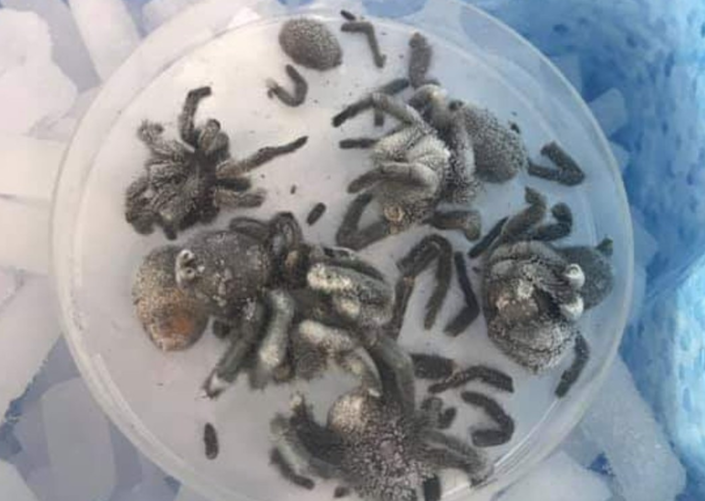

# The Australian Funnel Web Spider genome 
## About this space
This is an open public repository for anyone interested in contributing to the analysis of one of the world's deadliest spiders. Please feel free to contribute by performing independent or complementary analyses and reporting the results.  
## About the spider
The biological specimens were obtained from Queensland. Specimens are believed to be from the species *Hadronyche infensa*, commonly known as the Toowomba Funnel-Web spider. From the ["Find-a-spider guide for the Spiders of Southern Queensland"](http://www.findaspider.org.au/find/spiders/201.htm) website:
> The neurotoxin in the venom of the Toowoomba funnel-web spider can cause serious illness in an hour or two, the male producing the more potent venom although the volume injected is usually much smaller than for the female. Envenomation can be prevented by the application of a compression bandage over the bite site. An effective antivenom is now available in districts where funnel-webs are known to exist. Surprisingly, virtually all domesticated animals are naturally immune to funnel-web spider venoms.

Whole spider bodies were frozen and shipped to the Garvan Institute where DNA was extracted from legs to avoid sequencing gut microbes. More details on DNA extraciton to follow. 
## About the data
Different DNA extractions (DIN values ~6) were subjected to Nanopore sample preparation using the SQK-RAD004 protocol (may also have been multiplexed with SQK-RBK004, to check). Samples were run on MIN106 flowcells without nuclease flushing.  

7 flowcells were used: 2 for testing the samples and 5 for running the samples during a Nanopore workshop. Live base-calling was performed using MinKNOW (version to be confirmed). 

### Data location
Fastq and sequencing summaries generated during the sequencing run can be obtained here: https://cloudstor.aarnet.edu.au/plus/s/tE318MdmL9WMsje

Fast5 files will also be made available (stay tuned). 

